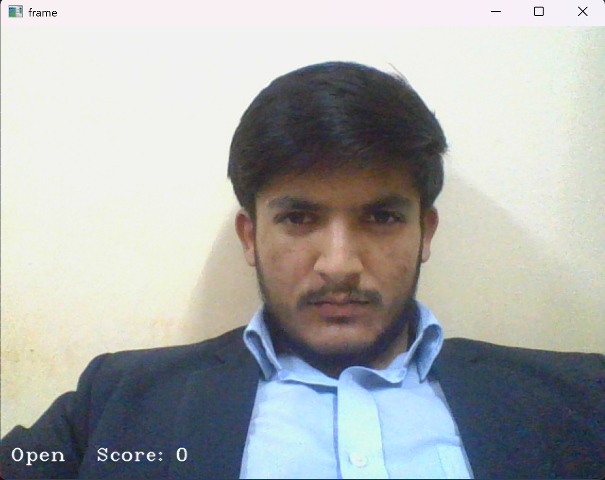
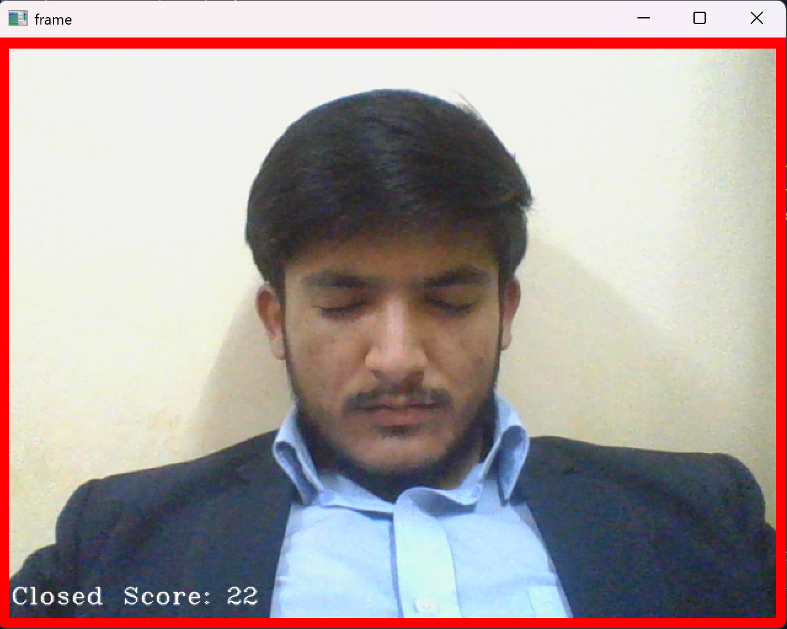

# Driver Drowsiness Detection System

A real‑time driver drowsiness detection system that uses computer vision and machine learning to monitor the driver’s face and eyes from a live camera feed and trigger alerts when signs of fatigue are detected. Such systems are widely used as an in‑vehicle safety feature to help prevent accidents caused by sleepy or inattentive driving.

---

## Features

- Real‑time video capture from webcam or external camera  
- Face and eye detection using classical vision (Haar cascades / dlib) or deep learning models (CNN)  
- Drowsiness metrics such as eye aspect ratio or eye‑state classification (open/closed) over time  
- Audible or visual alert when drowsiness is detected beyond a threshold duration  

---

## Demo

<p align="center">
  
  
</p>


## Folder Structure

```txt
Driver-Drowsiness-Detection-System/
├── data/
│   ├── train/
│   │   ├── Closed_Eyes/
│   │   └── Open_Eyes/
│   └── validation/
│       ├── Closed_Eyes/
│       └── Open_Eyes/
│
├── haar cascade files/
│   ├── haarcascade_frontalface_alt.xml
│   ├── haarcascade_lefteye_2splits.xml
│   └── haarcascade_righteye_2splits.xml
│
├── models/
│   └── cnnCat2.h5
│
├── alarm.wav
├── drowsiness detection.py
└── model.py
```


---

## Prerequisites

- Python 3.8+  
- pip (or conda)  
- Webcam or USB camera  

Typical Python libraries (add these to `requirements.txt` if not already present):

- `opencv-python`  
- `tensorflow` / `keras`  
- `numpy`  
- `imutils` (optional, for convenience functions)  
- `playsound` or similar package to play `alarm.wav`  

---

## Installation

### 1. Clone the repository

git clone https://github.com/sujal-chauhan/Driver-Drowsiness-Detection-System.git
cd Driver-Drowsiness-Detection-System


### 2. (Optional) Create and activate a virtual environment

python -m venv venv

Windows
venv\Scripts\activate

macOS / Linux
source venv/bin/activate


### 3. Install dependencies

pip install --upgrade pip
pip install -r requirements.txt


If `dlib` or any other heavy dependency is added later and fails to install with `pip`, follow its official installation guide for your OS and retry.

---

## Model Training

If you want to retrain or fine‑tune the CNN model:

1. Place training images of eyes in the appropriate folders:

   - `data/train/Open_Eyes/`  
   - `data/train/Closed_Eyes/`  

   and validation images in:

   - `data/validation/Open_Eyes/`  
   - `data/validation/Closed_Eyes/`  

2. Run the training script: python model.py


3. A trained model file (for example `cnnCat2.h5`) will be saved in the `models/` directory (update the path here if your script saves it somewhere else).

---

## Running Real‑Time Drowsiness Detection

Make sure:

- The trained model file (e.g., `models/cnnCat2.h5`) exists.  
- Haar cascade XML files are in the `haar cascade files` folder.  

Then run: python "drowsiness detection.py"


This script will:

- Start the webcam feed.  
- Detect the face and eyes using Haar cascades.  
- Use the CNN model to classify the eye state frame‑by‑frame.  
- Play `alarm.wav` if closed eyes (drowsiness) are detected for a configured number of consecutive frames.

If the script supports arguments (e.g., to change camera index or thresholds), you can extend or document them like : python "drowsiness detection.py" --camera 0 --threshold 0.25 --consec-frames 15


---

## Future Improvements

- Add yawning and head‑pose detection for more robust drowsiness estimation.  
- Improve dataset size and variety (different lighting, glasses, head poses).  
- Package the system into a GUI desktop app or integrate with an embedded/IoT system for in‑vehicle deployment.

---


